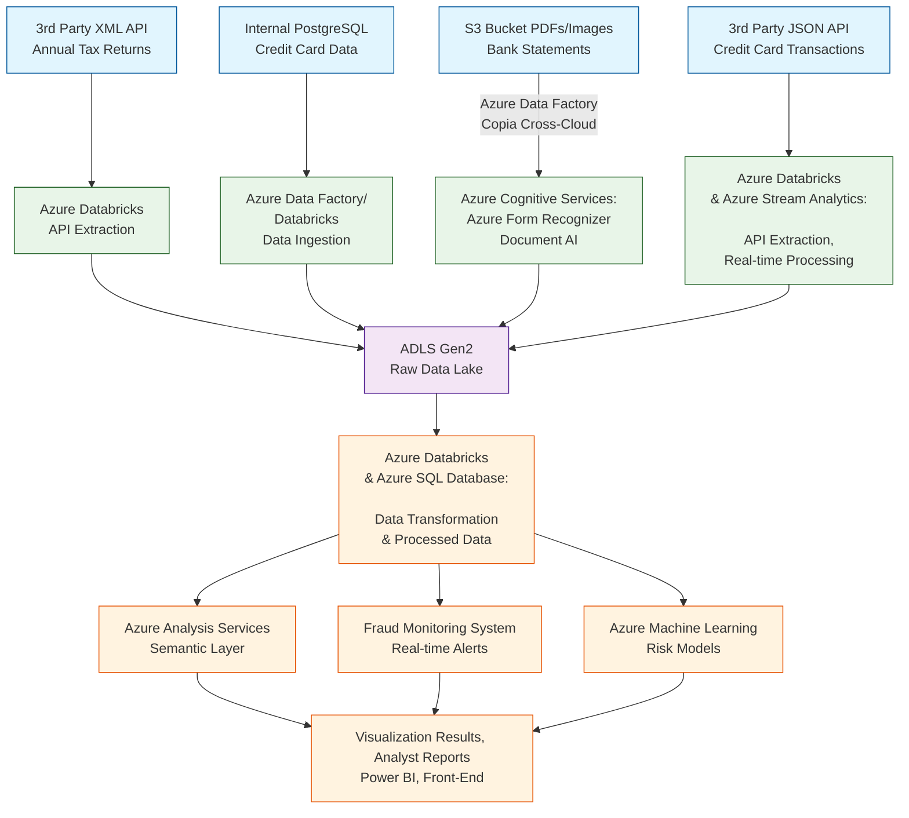

# The High Level Problem

**Candidato**: Alejandro Moscoso Deossa

**Fecha**: 27/08/2025

---
## Table of Contents
* [Introduction](#introduction)
* [Architecture Overview](#architecture-overview)
* [Technology Stack](#technology-stack)
* [Step-by-Step Architecture Implementation](#step-by-step-architecture-implementation)
 
## Introduction
As a data engineer with strong expertise in Azure cloud services, I'm proposing a solution built on the Microsoft Azure ecosystem.

While I have direct experience with core Azure services including:
    * Azure Data Factory (orchestration and ETL)
    * Azure Machine Learning (Machine Learning modeling)
    * Azure Functions and Logic Apps (Triggers or orchestators)
    * Azure SQL Database (data warehousing)
    * Azure Databricks (data processing and transformation)
    * Power BI (data visualization and reporting)
    * Azure Blob Storage (data lake storage)

I should note that some components of this proposal, particularly Azure Stream Analytics, Azure Cognitive Services and Azure AI, are based on industry standars or researchers rather than direct hands-on experience. I'm confident in my ability to quickly master them given my strong foundation in data engineering principles and Azure ecosystem.

I've also included AWS alternatives for each component since I noticed your current setup uses S3 storage, and you might have existing investments in AWS. The architecture concepts would work similarly across both cloud platforms.

## Architecture Overview

## Technology Stack

| Componente | Tecnología | Justificación | Experience | Alternativa |
|------------|------------|---------------|---------------|---------------|
| Orchestration | Azure Data Factory | Native Azure integration | ✅ | AWS Glue
| Data Lake | ADLS Gen2 | Scalable storage with file/blob capabilities | ✅ | Amazon S3
| Batch Processing | Azure Databricks | Optimized Spark engine, ML integration | ✅ | AWS EMR
| Database | Azure SQL Database | SQL familiarity, great performance | ✅ | Amazon RDS
| Real-time Processing | Azure Stream Analytics | SQL-like language | ❌| AWS Kinesis
| Machine Learning | Azure Machine Learning | End-to-end ML platform, AutoML | ✅ | Amazon SageMaker
| Visualization | Power BI | Best Azure integration, self-service | ✅ | Amazon QuickSight
| Document Processing | Azure Form Recognizer | AI-powered document extraction | ❌ | Amazon Textract

## Step-by-Step Architecture Implementation
### 1: Data Ingestion & Storage
#### 1.1: API Data Extraction:
Use Azure Data Factory to manage Databricks for API extraction.
Handle different API formats (XML, JSON) with proper authentication.
#### 1.2: Database Replication
Azure Data Factory for PostgreSQL or Databricks that have a code to read and clean the DB.
Continuous ingestion to ADLS Gen2 with schema evolution support
#### 1.3: Document Processing
Azure Form Recognizer extracts text from PDFs and images
AI models identify and classify financial document elements
Output stored in ADLS Gen2 as structured data
Databricks also can be used and Azure AI Services
### 2: Data Processing & Transformation
#### 2.1: Real-time Processing
Azure Stream Analytics for credit card transaction processing
SQL-like queries for pattern detection and anomaly scoring
Set up real-time scoring and anomaly detection
#### 2.2: Batch Processing with Azure Databricks
Clean, process the data through the zone raw, curated, process
### 3: Data modeling, Serving & Consumption
#### 3.1: Analyst Self-Service
Power BI connected to Azure SQL Database and Analysis Services
Direct Query mode for real-time dashboards
Import mode for better performance reports
#### 3.2: Machine Learning Features
Azure Machine Learning feature store for model consumption
Automated feature engineering and selection
Model deployment and monitoring pipeline
#### 3.3: Real-time Fraud Detection
Real-time scoring of transaction patterns
Alert generation and notification system
### 4: Visualization and results
Develop Power BI reports for business users
Create interactive dashboards for different stakeholders
Optionally develop front-end applications for specific use cases