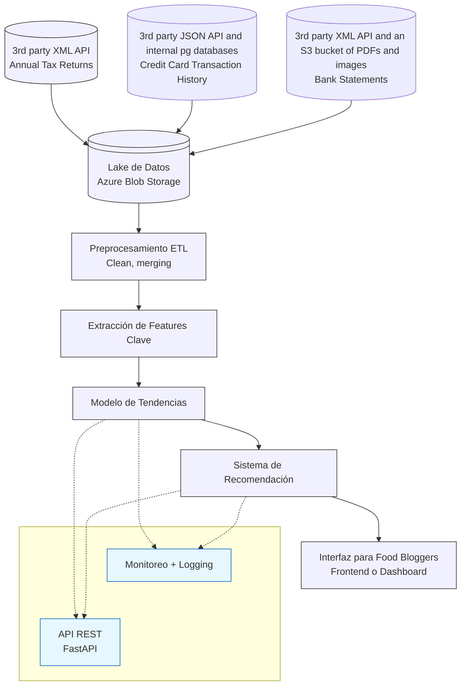

# The High Level Problem

**Candidato**: Alejandro Moscoso Deossa

**Fecha**: 27/08/2025

---

## 1. Arquitectura End-to-End

## 2. Stack Propuesto y Justificación

| Componente | Tecnología | Justificación |   Alternativa |
|------------|------------|---------------|---------------|
| Orquestación | Azure Data Factory | Orquestación visual, scheduling de pipelines y transformaciones básicas | Apache Kafka |
| Almacenamiento |  Data Lake Gen2 (Blob Storage) + SQL DB	Data Lake | Centralizado y escalable | PostgreSQL, S3, Azure SQL |
| Procesamiento | Azure Databricks (PySpark, Pandas) | Limpieza, unión y feature engineering | SQL |
| Modelado | Script en Azure Databricks + modelo registrado en Azure ML | Experimentos reproducibles | Prophet, MLflow, LightGBM, Word2Vec |
| Feature Store | Delta Lake | Versionado de features accesible desde Databricks | Opcional |
| API REST | FastAPI, Azure Function | Bajo costo y escalable | Azure App Service |
| Monitorización | Azure ML Studio | Métricas, alertas y trazabilidad | Prometheus + Grafana |
| Resultados | Azure Blob Storage, Azure SQL | Consulta, dashboarding y analítica posterior | Synapse |
| Frontend / BI | Power BI | Consulta, dashboarding y analítica posterior | Web App JS, CSS, React |
